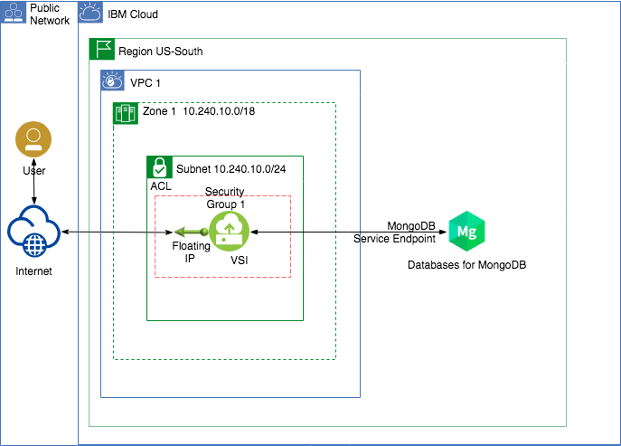

# Use GUI, CLI or API to deploy a VPC and connect a VPC Application to a MongoDB using a private endpoint.

### Purpose
This scenario illustrates how to deploy a Virtual Private Cloud (VPC), deploy an applicatio, and connect to __*Databases for MongoDB*__ using a private endpoint.

The example shown in this scenario includes a Node.js application which saves records to a MongoDB. The database will be deployed using a private endpoint so that communication is through the IBM Cloud private network (no Internet). To connect to IBM Cloud services over a private network, you must have access to classic infrastructure and enable virtual routing and forwarding (VRF) and connectivity to service endpoints for your account. Then, you can start creating services that support service endpoints for a private network connection.

For more information, please refer to the following docmentation:

[Setting up service endpoints on IBM Cloud](https://cloud.ibm.com/docs/resources?topic=resources-private-network-endpoints)

[Service endpoints available for IBM Cloud VPC](https://cloud.ibm.com/docs/vpc-on-classic?topic=vpc-on-classic-service-endpoints-available-for-ibm-cloud-vpc)

[Databases for Mongo - Service Endpoints Integration](https://cloud.ibm.com/docs/services/databases-for-mongodb?topic=cloud-databases-service-endpoints)

After completing the scenario you will be able to:
- Create Virtual Private Clouds using the IBM Cloud console (UI), Command Line Interface (CLI), or Application Programming Interface (API).
- Create Linux Virtual Servers in a Virtual Private Cloud
- Connect to and execute commands in a linux Virtual Server
- Deploy a Databases for MongoDB.
- Configure a Node.js application to use an the MongoDB.
- Save data into the MongoDB.

### Architecture


### Prerequisites
1. An IBM Cloud Account
2. Authority to create VPC resources and IBM Cloud Object Storage services in the IBM Cloud Account
3. ssh-keygen installed locally. [SSH Keys](https://cloud.ibm.com/docs/vpc-on-classic-vsi?topic=vpc-on-classic-vsi-ssh-keys#ssh-keys)
4. An account with [Virtual Routing and Forwarding](https://cloud.ibm.com/docs/account?topic=account-vrf-service-endpoint#vrf) (VRF) enabled.

### Assumptions
1. The reader has a basic knowledge of Linux commands and VI editor.

### Deploy VPC infratrsucture
The instructions to deploy the VPC infrastructure for this scenario are available in these flavors:
1. [Using the IBM Cloud CLI](README-cli.md)
2. [Using the IBM Console UI](README-console.md)
3. [Using the IBM Cloud API](README-api.md)

### Deploy Databases for MongoDB

1. Select Databases for MongoDB in the [IBM Cloud Catalog](https://cloud.ibm.com/catalog/services/databases-for-mongodb)
2. Provide a Service Name and Pricing plan.
3. Select Dallas region and other values as needed.
3. Under *"Endpoints"*, select `Private Network`.
4. Create instance of new service.
5. Wait until the database instance is created. Then select `Service Credentials` and create a new Service Credential for this application.

Once `Databases for MongoDB` has been created, we will use some of the steps noted in the Databases for MongoDB [Getting Started Tutorial](https://cloud.ibm.com/docs/services/databases-for-mongodb?topic=databases-for-mongodb-getting-started). This includes installing a Node.js application from Github.

### Access the VPC's Virtual Server to install a Node.js application and configure it to access the MongoDB

1. Issue the following command to access the Virtual Server from your workstation: 
   
   `ssh root@*floating ip*`  
    - The *floating ip* is the IP address assigned to the VPC's VSI in the previous section.

   If you need to specify the SSH Key file, use the following command:

   `ssh -i *ssh key file* root@*floating ip*`
    - The *ssh key file* is the full path and filename of the SSH Key file created in Section #2 above.

2. Update the local package repository. Issue the command 

   `apt-get update`
3. Install the LTS version of [Node.js](https://nodejs.org/en/) (which includes NPM) by issuing the following commands:
    - `curl -sL https://deb.nodesource.com/setup_10.x | sudo -E bash -`
    - `sudo apt-get install -y nodejs`
4. Verify the Node.js and NPM installation is complete by issuing the commands:
    - `node -v`
    - `npm -v`

5. Clone the Node.js version of "Hello World" sample app from GitHub (the Ubuntu image includes Git in the installation)
    - `git clone -b node http://github.com/IBM-Cloud/clouddatabases-helloworld-cloudfoundry-examples.git`

6. Get to the mongodb directory
    - `cd clouddatabases-helloworld-cloudfoundry-examples/mongodb`

7. Install dependencies listed in the package.json file.
    - `npm install`

8. Using the VI editor (or an editor of your choice), create file `vcap-local.json` and add the following:
```
{
 "services": {
   "databases-for-mongodb": [
     {
       "credentials": INSERT YOUR CREDENTIALS HERE
     }
   ]
 }
}
```
Replace `INSERT YOUR CREDENTIALS HERE` with the entire MongoDB credential you created for this application and save the file.
   *Hint: in VI, press the Colon key and then type wq! and press enter*

9. Start the applicaton
    - `npm start`

10. On a browser, enter the public IP address of the VSI and port 8080 to access the Hello World! application.
    - `http://<floating_ip>:8080/`

11. Test the application by adding a few records to the database.


## Links
- [IBM Cloud VPC](https://cloud.ibm.com/docs/vpc-on-classic?topic=vpc-on-classic-getting-started)
- [IBM Cloud Databases for MongoDB](https://cloud.ibm.com/docs/services/databases-for-mongodb?topic=databases-for-mongodb-getting-started)
